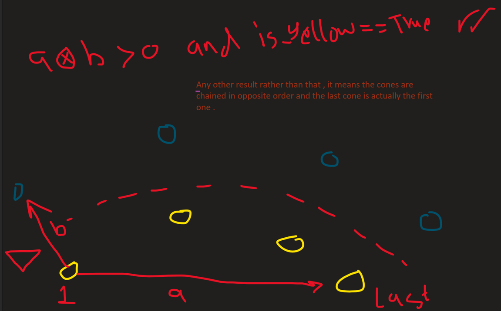
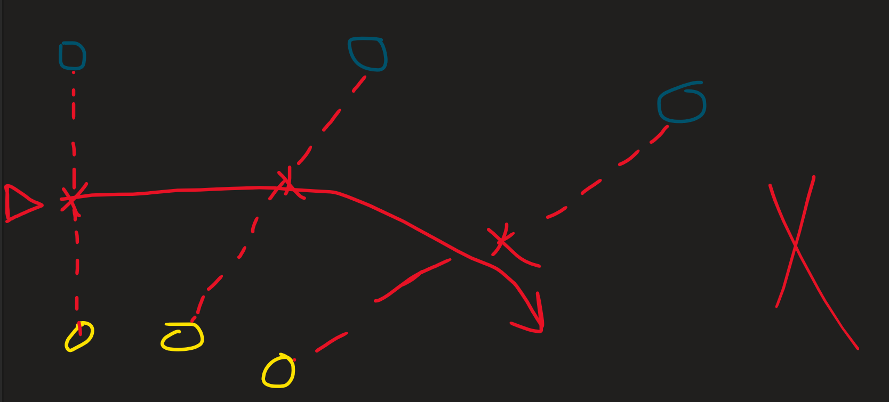
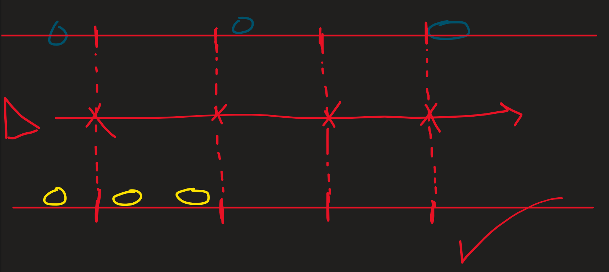
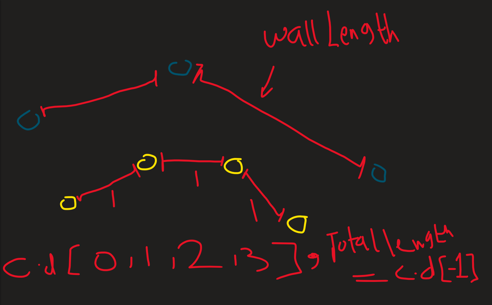
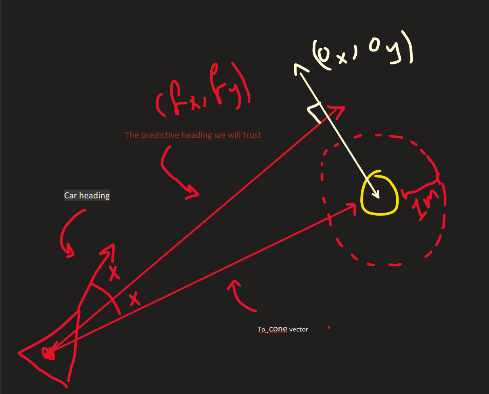
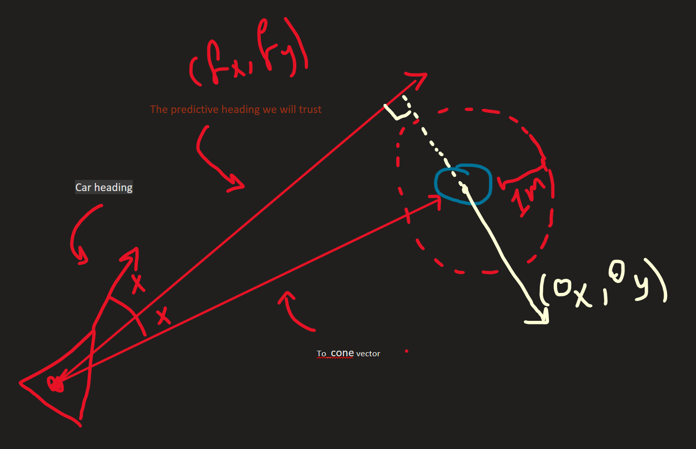
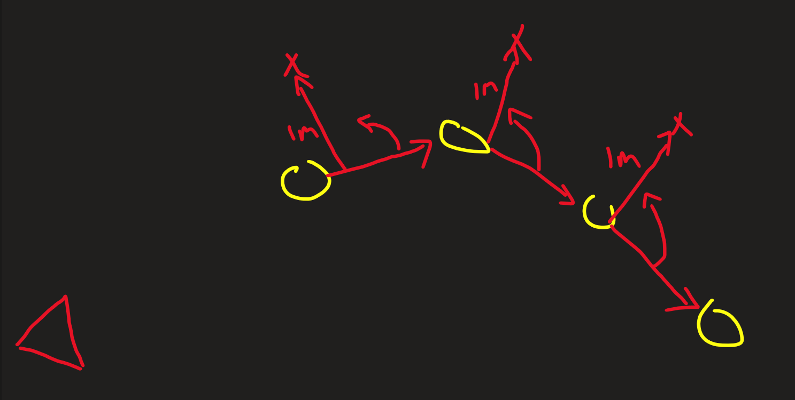

## Path Planning Assignment — Solution

### Task Description

#### Part 1

Given up to **two cones** (sometimes only one or none), each with coordinates `(x, y)` and a `color` flag:
- `color == 0`: yellow cone (right side of the track)
- `color == 1`: blue cone (left side of the track)

And the car pose `(x, y, yaw)`, the goal is to return a sequence of path points `(x, y)` in world coordinates representing a drivable route between the boundaries.

#### Part 2

Extend the algorithm to handle **three cones on one side** of the track.

---

### Quick Start

1. Install Python 3.9+.
2. Create a virtual environment and install dependencies:

```bash
python3.9 -m venv .venv
source .venv/bin/activate   # Linux/macOS
pip install -r requirements.txt
pip install PyQt5           # for interactive window display
```

3. Run a scenario:

```bash
DISPLAY=:0 python -m src.run --scenario 2
```

Available scenarios: `1` to `25`.  
Scenarios `1`–`20` are original (up to 2 cones per side).  
Scenarios `21`–`25` are Part 2 additions (3 cones on one or both sides).

---

### Files Overview

- `src/models.py`: Data classes for `Cone`, `CarPose`, and `Path2D` alias.
- `src/path_planning.py`: **`PathPlanning`** — the main implementation (`generatePath`).
- `src/tester.py`: Matplotlib visualizer that plots cones, the car, heading, and the path.
- `src/scenarios.py`: Pre-built scenarios 1–25 for testing.
- `src/run.py`: CLI entry point to run and visualize a scenario.

---

### Solution Explanation
this algorithm is majorly centerline orianted but in the same time ,IT IS A VECTOR BASED APPROUCH , so take a deep breath and jump :)
#### Algorithm Overview

The algorithm is implemented in [`src/path_planning.py`](src/path_planning.py) inside `PathPlanning.generatePath()`. It runs in three sequential phases:

```
Input: car_pose (x, y, yaw) + cones [(x, y, color)]
   ↓
Phase 1: Order cones along track direction
   ↓
Phase 2: Compute centerline waypoints from boundaries
   ↓
Phase 3: Smooth Catmull-Rom spline + arc-length resampling
   ↓
Output: path [(x, y), ...], 28 points at 0.25m spacing, ~7m long
```

---
```
#### Phase 1 — Ordering Boundary Cones

When multiple cones exist on the same side, they must be ordered progressively along the track (not just sorted by x or y, which would break on curves).
just to visualize:
       [Cone 3] (X=15, Y=12)
          \
           \  <- Curve bends right
            \
       [Cone 2] (X=12, Y=15)  <-- Y is HIGHER than Cone 3!
          /
         /
    [Cone 1] (X=5, Y=5)
      ^
      |
   [  🚗  ] (Car moving up/forward)


**Approach: greedy nearest-neighbor chain starting from the cone closest to the car.**
This correctly handles straight and curved boundaries. For 1 or 2 cones, the order is trivially determined.
implemented in  _order_boundary fucntion where we find nearest cone to the car (using simple hypt func) then from that cone we found ,we look for the closest one to it ,and so on , to create a chain .this is will helpo us in tarcking the oriantation of the road . 


##Orientation correction (cross-product check):  
After chaining, we verify the boundary direction is consistent with the track layout using the 2D cross product:
mathematical idea just for you ;  If cross > 0: The point is on the left of the line.
 if cross < 0: The point is on the right of the line.


v = (last_cone - first_cone)  #to get the general vector pointing toward track direction that the car is supposed to go through

d_other = (closest_opposite_cone - first_cone)  #another vector pointing from the closest cone to the car toward the closest cone to car but the other color , this explains it:
```

```
cross = v.x * d_other.y - v.y * d_other.x 


- If yellow cones (right side) and `cross < 0` → the ordering is flipped → reverse.
- If blue cones (left side) and `cross > 0` → the ordering is flipped → reverse.

This ensures the path direction is always forward relative to both boundaries.
```
---

#### Phase 2 — Centerline Waypoints

Given ordered yellow and blue cone lists, we compute the track centerline midpoints:

| Available cones | Strategy |
|---|---| N and M are arbietary numbers
| 0 cones on both sides | Straight line ahead along `yaw` |
| 1 yellow + 1 blue | Midpoint of gate; forward tangent from perpendicular |
| N yellow + 1 blue | Assume lane width from nearest gate pair, project virtual blue cones |
| 1 yellow + N blue | Symmetric to above |
| N yellow + M blue | Resample both polylines to equal length, average midpoints |
| N yellow only | Compute inward normal (left) at each cone, offset by `R=1.0m` |
| N blue only | Compute inward normal (right) at each cone, offset by `R=1.0m` |

**Nominal half-width `R = 1.0 m`** is the assumed half-track width when only one boundary is visible. This is a design assumption — in a real system it would come from track specifications.

THE MATH BEHIND THIS :
# Case A: Both boundaries are observed
   # Subcase A1: Exactly 1 cone on each side (single track gate) the easiest one
   just get ( (y0.x + b0.x) / 2.0, (y0.y + b0.y) / 2.0 ) and that the mid between the two cones ,
   then we want another point after that mid to draw a stright line for the car ,but which direction to put that second point ,that will be decided based on comparison between vector between car and mid (to_mid) and perpendicular vector(tx,ty) to the vector connecting the two cones ,like this :
   
   simple ,right? ...
   # Subcase A2: Multiple yellow cones, 1 blue cone (project missing blue boundary)
   we will take that lonely blue cone and gat the closest yellow cone to it ,then get vector from closest yellow and the 1 blue ,
   then calculate the offset between them ,then the mid pts will be (yellow + (yellow+offset)) / 2.0 for both x and y componants , and so do for the rest of yellow cones with no blue pair:
   
   # Subcase A3: Multiple blue cones, 1 yellow cone (project missing yellow boundary)
   same as above logic but switch the lone cone to get the closest other color

   # Subcase A4: Multiple cones on both sides (e.g. 2 & 2, 3 & 3, 3 & 2)
   we will solve this problem using resampling methode , the problem is :
   
   the resample method is simple , step1-take yellow boundary for example ,you get the length of that wall ,then get markers that follow that wall but using a prevoiusly defined spacing length ,and get the (x,y) of those markers , do the same in the other wall , now you have iamginary cones and can depend on and get the midpoints as we did before .
   
   so what is going on mathematically ??

   first we calculate the cummulative absolute distances between each two cones in same boundary color and cummulate that in a list called cummulative_dists[] :
   
   then we get the spacing between markers using wall_length and num_sample (4 minimum) ..python{ target_d = (j / (num_samples - 1)) * total_len  }
   then we look for the two cones (same color) that ,that marker belong between them so we get (x,y) of that marker relative to the first cone using : python{ 
      if cummulative_dists[k] <= target_d <= cummulative_dists[k + 1]: #looking for the two cones where that target_d is between them so we can assign (x,y) for that target_d
                    seg_len = cummulative_dists[k + 1] - cummulative_dists[k] #absolute diff between those two cones we found
                    t = (target_d - cummulative_dists[k]) / seg_len if seg_len > 1e-6 else 0.0 #just a percentage to know how much that marekr is displaced ,to the [k] cone or to [k+1] cone so we can control the place of the marker betwen the found 2 cones
                    rx = pts[k][0] + t * (pts[k + 1][0] - pts[k][0]) #the assigning of x componant 
                    ry = pts[k][1] + t * (pts[k + 1][1] - pts[k][1]) # the y 
                    resampled.append((rx, ry)) # and append}
   now we have list called resampled contains just points ,we put the blues in that function to get b_pts and the yellow to get y_pts ,then apply the usual (X2+X1)/2 and (Y2-Y1)/2 to get the mid points.
# Case B: Only one boundary is observed
   # Single cone visible
      we will follow a predictive way here , we will get a vector which has angle in between car heading and from_car_to_cone vector as a starting point for us ,then we will get unit vector of that middle vector,then rotate it 90 degree clockwise if blue or counterclockwise if yellow :
      
---


```
then we add the x and y of that lonely cone to the offset (ox,oy) we got , to get the point which is perpendcular from the middle vector and in the true direction (to left if blue , to right if yellow) ,add to that another point so we can draw a stright line and smoother can work (we will discuss the smoother later). 
```
```
   # Multiple cones on single boundary (2, 3, or more)
      we will do the same as above but forget about the middle vector(we did that because we didn't got any info so we had to improvis) .
      we will get the vector between each two cones (same boundary of course) and oriante that 90 degrees (clockwise if blue , counterclockwise if yellow) and add the R=1.0m as my assumption says in that direction ,collect those in list called mid and return.
```


from here my job was done , the rest is well known ways to smooth out the generated path given Path2D ,it will smoothen it using two functions 
(
   def _catmull_rom_sample(
        self,
        knots: List[Tuple[float, float]],
        step: float,
        target_length: float,
    ) -> Path2D: 
    and 
    def _generate_smooth_path(
        self,
        car_x: float,
        car_y: float,
        car_heading: Tuple[float, float],
        waypoints: List[Tuple[float, float]],
        target_length: float = 7.0,
        step: float = 0.25,
    ) -> Path2D:
    )
 and that's an overview of what i meant by smoothing:
#### Phase 3 — Smooth Path Generation (Catmull-Rom Spline)

A **Catmull-Rom spline** is interpolated through the computed waypoints. It produces a smooth C¹ continuous curve that passes exactly through every waypoint, with no oscillation between them.

**Key design choices:**
1. **Lead control point**: A point is inserted `0.4–1.0m` ahead of the car along `yaw` to ensure the path starts tangent to the car's current heading.
2. **Forward extension**: If the waypoints don't cover the target path length (7m), the path is extended linearly along the final tangent direction.
3. **Arc-length resampling**: After generating a dense set of spline points, the path is resampled at exactly `step=0.25m` intervals using cumulative arc-length interpolation — ensuring every step is within the `<= 0.5m` constraint.

**Result:** 28 path points, all exactly 0.25m apart, total length ~6.7–6.8m.

---

#### Part 2 — Handling 3 Cones Per Side

The same algorithm handles 3+ cones seamlessly:

- **3 blue cones (left only)**: Greedy chain, compute right-side normals at each cone offset by `R=1.0m`.
- **3 yellow cones (right only)**: Greedy chain, compute left-side normals at each cone offset by `R=1.0m`.
- **3 blue + 1 yellow**: Projects a virtual matching yellow boundary by repeating the gate width offset, then averages midpoints.
- **3 yellow + 2 blue** (or 3+3): Resamples both polylines to the same density and averages midpoints.

New test scenarios 21–25 cover all these configurations. Run them with:

```bash
DISPLAY=:0 python -m src.run --scenario 21   # 3 blue only
DISPLAY=:0 python -m src.run --scenario 22   # 3 yellow only
DISPLAY=:0 python -m src.run --scenario 23   # 3 blue + 1 yellow
DISPLAY=:0 python -m src.run --scenario 24   # 3 yellow + 2 blue
DISPLAY=:0 python -m src.run --scenario 25   # 3 blue + 3 yellow
```

---

### Assumptions Made

1. **Nominal half-track width `R = 1.0 m`**: When only one boundary side is visible, the centerline is offset `1.0m` inward from the visible cones. Real FSAI track width is typically 3–4m, giving a half-width of ~1.5–2m.
2. **All cones belong to the immediately upcoming track section**: We don't filter cones behind the car or far off-track.
3. **The car starts at or near the track entrance**: The heading vector `yaw` is a reliable guide for the initial path direction.
4. **Uniform cone density**: The greedy nearest-neighbor chaining assumes cones are placed reasonably close to each other with no large gaps that would confuse the ordering.
5.**the car always starts at (0.0,0.0)**: as the given scenarios include.

---

### Limitations

1. **No loop closure**: The algorithm generates a local path only (~7m ahead). It does not plan globally around a full track.
2. **Greedy ordering fails for criss-crossed cones**: If cones from both sides interleave spatially (e.g. extreme S-bends with close cones), the nearest-neighbor chain could misorder them.
3. **Fixed half-width assumption**: When only one boundary is visible, the fixed `R=1.0m` offset may not match the actual track width.
4. **No obstacle avoidance**: The path stays between cones but does not account for dynamic obstacles or safety margins.
5. **No velocity or curvature constraints**: The path is geometrically smooth (C¹) but curvature is not bounded — sharp turns near tight gates could exceed vehicle dynamics limits.
6. **No filtering of noise**: Assumes cone positions are perfect (no GPS/LiDAR noise).
7.it will fail in case of 3 or 4 cones are precieved (2 left and 2 right) , perception fault, been working on it.
7.**no memory** : it can't remember the cones passed on it so to predict what the next midpoints should be ,same idea of EKF ,maybe i will implemet that someday .
---

### Author's Notes
-i tried my best to explain every mathematical operation or geomitrical manupulation happened so have fun exploring .
- The approach is deliberately simple: order → midpoint → spline → resample.
- No external libraries beyond `matplotlib` and standard Python `math` are used.
- The Catmull-Rom spline was chosen because it passes through all control points (unlike Bezier) and it is not of my made.
- The arc-length resampling ensures the step-size constraint is met exactly.

